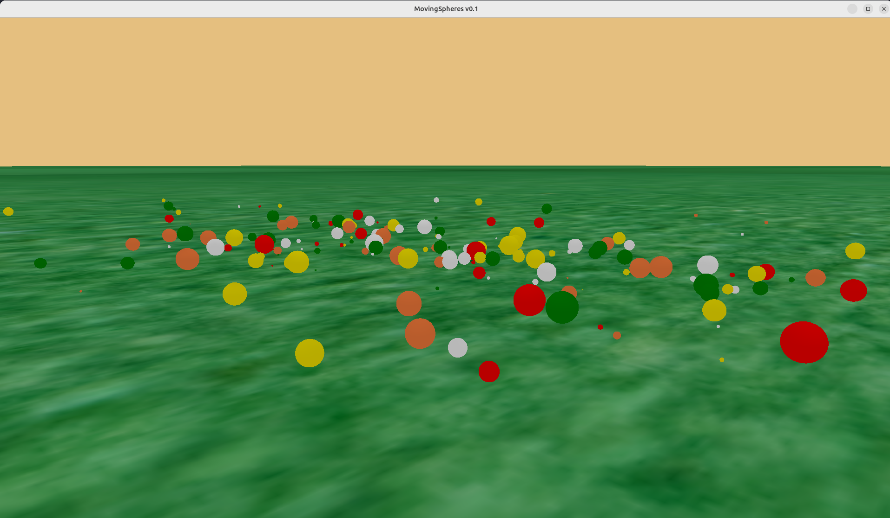

# MovingSpheres

## Descripción

**MovingSpheres** es una aplicación de simulación física que genera múltiples esferas con diferentes tamaños y materiales, utilizando **Ogre** para el renderizado 3D y **PyBullet** para la simulación de físicas.

## Características

### Esferas
- Se generan **200 esferas** con propiedades aleatorias
- **Tamaños variables**: radios que van desde 0.01 hasta 0.3 unidades
- **Materiales diversos**: cada esfera utiliza uno de los siguientes materiales de forma aleatoria:
  - `green_material` - Material verde
  - `red_material` - Material rojo
  - `white_material` - Material blanco
  - `wood` - Material de madera
  - `yellow_material` - Material amarillo

### Físicas (PyBullet)
- Simulación física realista con PyBullet
- Gravedad configurada en dirección Y negativa
- Las esferas se generan en posiciones aleatorias y caen por efecto de la gravedad
- Colisiones y rebotes entre esferas y con el suelo
- Propiedades físicas configurables (restituciones, fricción lateral)

### Renderizado (Ogre)
- Renderizado 3D utilizando el motor gráfico Ogre
- Iluminación direccional y luz ambiental
- Cámara en modo libre (free look)
- Sincronización entre el estado físico (PyBullet) y la representación visual (Ogre)

### Suelo
- El suelo utiliza un material texturizado (`ground`) basado en la imagen `ground.jpg`
- Collider plano para las físicas con propiedades de rebote y fricción

## Tecnologías Utilizadas

- **Ogre**: Motor gráfico 3D para renderizado
- **PyBullet**: Motor de simulación física
- **Python**: Lenguaje de programación principal

## Imagen de la Aplicación



## Estructura del Proyecto

```
06_MovingSpheres/
├── MovingSpheres.py      # Código principal de la aplicación
├── resources/
│   ├── all.material      # Definiciones de materiales
│   ├── ground.jpg        # Textura del suelo
│   ├── UI.png            # Captura de pantalla de la aplicación
│   └── ball.jpg          # Textura adicional
├── resources.cfg         # Configuración de recursos de Ogre
└── lib/                  # Librerías personalizadas
```

## Autor

Jonatan Gallo
Jesús Romero
Juan Camilo Torres

## Versión

v0.1

